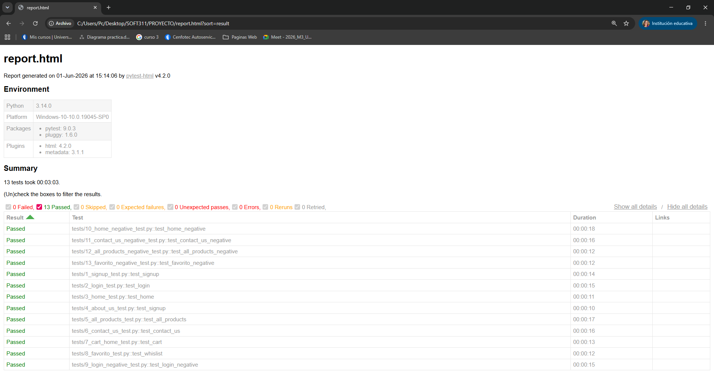

# Proyecto Final

- Nayeli Castillo Morales
- 01/06/2026

## Instalacion

```py
py -m venv .venv
.venv\Scripts\activate
.\.venv\Scripts\python -m pip install --upgrade pip
.\.venv\Scripts\pip install -e .
.\.venv\Scripts\python -m playwright install chromium
.\.venv\Scripts\python -m pip install pytest-html
```

# Ejecucion General (Con reporte)

```py
.\.venv\Scripts\python -m pytest --html=report.html --self-contained-html
```

# Ejecucion Individual (Sin reporte)

```py
.venv\Scripts\python -m pytest .\tests\1_signup_test.py
.venv\Scripts\python -m pytest .\tests\2_login_test.py
.venv\Scripts\python -m pytest .\tests\3_home_test.py
.venv\Scripts\python -m pytest .\tests\4_about_us_test.py
.venv\Scripts\python -m pytest .\tests\5_all_products_test.py
.venv\Scripts\python -m pytest .\tests\6_contact_us_test.py
.venv\Scripts\python -m pytest .\tests\7_cart_home_test.py
.venv\Scripts\python -m pytest .\tests\8_favorito_test.py
.venv\Scripts\python -m pytest .\tests\9_login_negative_test.py
.venv\Scripts\python -m pytest .\tests\10_home_negative_test.py
.venv\Scripts\python -m pytest .\tests\11_contact_us_negative_test.py
.venv\Scripts\python -m pytest .\tests\12_all_products_negative_test.py
.venv\Scripts\python -m pytest .\tests\13_favorito_negative_test.py
```

# Evidencias de ejecución


